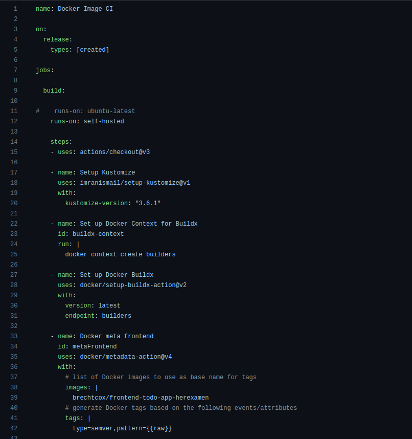
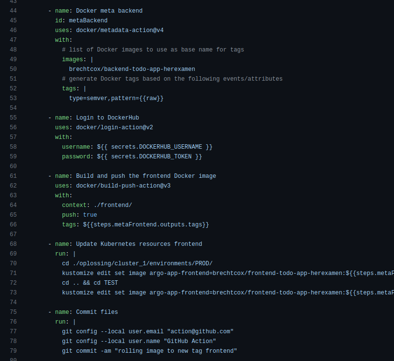
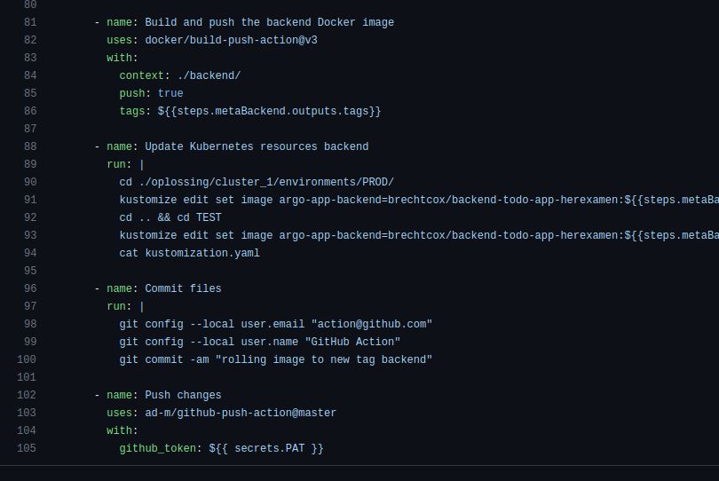

# PE Opdracht documentatie/demo stappen 

# Praktisch

## Clusteromgeving

- Voor een lokale kubernetes mag je ook minikube gebruiken ipv k3d.
- Cloud providers: AWS, Google, Azure, Oracle.

## Applicatie

### frontend

- Angular 12

### Backend

- NodeJS + express + mongoose
- there is a `/health` endpoint available for health checking

### Database

- MongoDb

---

# Demo stappen

De oplossing directory bevat al de nodige scripts, YAML-files,... 
De setup gebeurt ook in de volgorde die hieronder beschreven staat. Dat betekent dus dat eerst de Artillery-cluster wordt opgestart en daarna de Webapp/Elastic-cluster.

## Artillery-cluster

Deze cluster bevat de Artillery-deployments

Om de Artillery-cluster/deployments op te starten voer je volgende stappen uit:
- Voer het script uit in "/oplossing/cluster_2/artillery-operator/script_cluster2.sh

Met deze stap wordt er een k3d-cluster opgestart en de Artillery-operator gedeployed. In de map "/oplossing/cluster_2/artillery-scripts" bevinden zich de scripts voor
de webapp te testen en loads te generen. Eerst moet de Webapp-cluster opgestart worden (zie volgende stap).

## Webapp/Elastic-cluster

### Belangrijk voor het starten van het script:

Het bestand "/oplossing/cluster_1/secret_runner.yaml" bevat mijn Github-token (met base64 encryption). Omdat deze encryptie toch niet zo velig is, heb ik een deel van de string weggelaten. Om de runner te laten werken zal er een geldige string moeten toegevoegd worden. Dit kan gemakkelijk door een geldige Github-token te encrypteren.

- echo "YOUR_GITHUB_TOKEN" | base64

Vervolgens moet deze string toegevoegd worden aan het bestand "/oplossing/cluster_1/secret_runner.yaml" op de plaats waar nu de afgekapte string staat.

Dus achter de "github_token:".

Eens dit gedaan is kan het script uitgevoerd worden en zal de self-hosted runner werken.

Deze cluster bevat de todo-app, Elasticsearch, Kibana en Argocd. Ook bevat deze cluster de self-hosted actions runner. 

Om de webapp/elastic-cluster/deployments op te starten voer je volgende stappen uit:
- Voer het script uit in "/oplossing/cluster_1/script.sh

Het script zal ongeveer 6-7 minuten runnen omdat er een "sleep"-commando is toegevoegd. Dit is nodig omdat soms de Docker images van Elasticsearch heel traag gepulled worden. 
Ook zal het een commando uitvoeren om de port-forwarding van Kibana en Argocd in de achtergrond te doen. Daarnaast worden zowel het Argocd-wachtwoord als het Kibana-wachtwoord teruggeven zodat 
deze kunnen gebruikt worden om in te loggen. Als de port-forwarding toch niet zou werken, kunnen volgende commando's manueel worden uitgevoerd (niet nodig normaal):

- kubectl port-forward svc/argocd-server -n argocd 8079:443 > /dev/null 2>&1 &
- kubectl port-forward svc/kibana-kibana 5601:5601 > /dev/null 2>&1 &

Het script zet volgende dingen op:
- De webapp (Todo-app)
- Elasticsearch 
- Kibana voor het visualiseren van de metrics/logs
- Metricbeat die de logs verzameld van de verschillende pods, nodes,...
- Self-hosted git runner
- Argocd voor het deployen van de app
- Als laatste geeft het script ook het opgestelde dashboard mee aan Kibana (export.json) zodat dit meteen beschikbaar is als de gebruiker zich aanmeldt.

* Kibana:  "http://localhost:5601"
* Todo-app: "http://localhost:9999"
* Argocd:   "http://localhost:8079"

---

# Github Actions

## Werking Github Actions 

#

**Github Actions screenshot**

#

Github Actions wordt uitgevoerd op een self-hosted Kubernetes pod. 
Eerst wordt Kustomize en Buildx opgezet zodat dit later kan gebruikt worden in het script.
De derde stap dient voor het bouwen van de Dockerfile voor de frontend.

#

**Github Actions screenshot**

#

Er worden tags aangemaakt, voor front- en backend, aan de hand van het label dat is meegeven.
Daarna wordt er ingelogd op Dockerhub zodat de aangemaakte Docker images kunnen worden gepusht.
Ook wordt de Dockerfile van de frontend gebuild en gepusht naar de Docker repository.

#

**Github Actions screenshot**

#

De Kustomization.yaml files worden aangepast (/oplossing/cluster_1/environments/PROD/kustomization.yaml en /oplossing/cluster_1/environments/TEST/kustomization.yaml). De nieuwe versies van de Docker images worden meegegeven zodat Argocd deze veranderingen kan
oppikken en deze kan deployen in de Kubernetes-cluster.
De veranderingen worden gecommit en gepusht naar de git repository.
Dit wordt voor zowel backend als frontend gedaan.

---

# Elasticbeat/metricbeat

Verzamelen en slagen metrics op over de Kubernetes-cluster, pods,...

---

# Kibana

Bevat de dashboards met metrics van Elasticsearch/Metricbeat. 

---

# Todo app

De app, die gedeployed wordt. Deze is bereikbaar via een Ingress-object.
Er is gebruik gemaakt van role-based-access-control zodat de access is afgeschermd van de verschillende deployments.

---

# ArgoCD 

Zorgt ervoor dat de todo app gedeployed wordt en altijd de laatste versie is.

---

# Artillery

Als laatste zijn er de loadtest scripts van Artillery. Na het opzetten van de twee clusters moet de kube-configuratie aangepast worden zodat de cli terug kan communiceren met de Artillery-cluster.
Pas "~/.kube/config" aan zodat de "current-context" terug de "artillerycluster" is. Nu kunnen de loadtests uitgevoerd worden door de scripts in de "/oplossing/cluster_2/artillery-scripts" uit te applyen.
Dit kan aan de hand van volgend commando:

- Navigeer eerst terug naar de "cluster_2" folder
- kubectl apply -k oplossing/cluster_2/artillery-scripts

De loadtest zal uitgevoerd worden en de pods van de backend zullen naar 4 gescaled worden.
